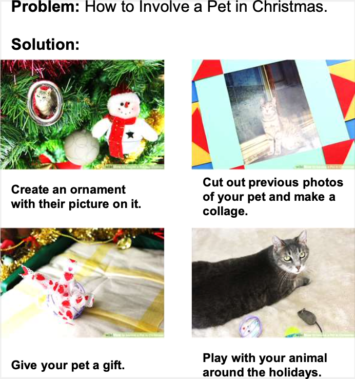

# VisualHow: Multimodal Problem Solving

<p float="left">
  
</p>

Reference
------------------
If you find the code useful in your research, please consider citing the paper.
```text
@InProceedings{jinhui:2022:visualhow,
    author={Jinhui Yang and Xianyu Chen and Ming Jiang and Shi Chen and Louis Wang and Qi Zhao},
    title = {{VisualHow}: Multimodal Problem Solving},
    booktitle = {Proceedings of the IEEE Conference on Computer Vision and Pattern Recognition (CVPR)},
    year = {2022}
}
```

## Dataset
The dataset is available [here](https://drive.google.com/drive/folders/13Tm4y0ZBLqN_i1EGXDdyu7pVG2Uaq7O5?usp=sharing), it contains the following files:
	
* **wikiHow_data.json**: json file of all 20,028 problems with their corresponding WikiHow data

```
{'problem_id': unique ID of each problem, which is made up of the article ID and method index with an underscore in between (str, e.g. 033313_0):
  {
    'article_id': ID assigneed to each unique wikiHow article (str, e.g. 033313),
    'category': list of categories, annotated by wikiHow,
    'url': URL of the unique wikiHow article,
    'article_title': title of the wikiHow article,
    'problem_title': title of the problem (which is part of the article),
    'problem_index': index of the particular problem in terms of the article (str, e.g. 0),
    'image_url': list of URLs for all images used in this problem,
    'step_list': list of textual step descriptions used in this problem
  }
...
}
```

* **visualHow_annotations.txt**: text file of all 20,028 problems with their Visual How annotations

```
[
  {
    'article_id': ID assigneed to each unique wikiHow article (str, e.g. 033313),
    'problem_index': index of the particular problem in terms of the article,
    'problem_title': title of the problem,
    'image_category': the annotated type of image of the problem - can be realistic, abstract, or mixed,
    'step_to_object_selected_result': a list of annotated phrases for this problem. For each step, there are 2 sublists - first one corresponds to multimodal attention, second one is for words without visual correspondence,
    'step_to_object_bbox_result': a list of bounding boxes for this problem. For each step, there are 3 sublists - first one corresponds to multimodal attention, where each phrase may have multiple annotated bounding boxes, second one is by default empty, and third one is for visual attention without textual correspondonce,
    'step_to_dependency_index_result': a 2d list of dependency annotations for each step, where the indices in each sublist refer to the indices of steps that the current indexed step is dependent on,
    'dependency_type': type of dependency structure - can be sequential, parallel, or others,
    'split': type of split used in our experiments in the paper - can be train, test or val
  }
...
]
```
Use the following code to read the json file and the text file:

```pythom
import json

wikiHow_data = json.load(open("wikiHow_data.json", "r"))
visualHow_data = []

for line in open("visualHow_annotations.txt", "r"):
    visualHow_data.append(json.loads(line))
```
## Update 3/17/23
We have completely re-annotated over 600 VisualHow tasks that had incorrect bounding boxes, dependency annotations, and word annotations that were not up to standard, etc. We have also automatically corrected small issues for all data. Please let us know if there are more issues with the data. For other concerns or questions, feel free to open an issue on our GitHub page or email me @ yang7004 at umn.edu. Cheers and have fun!
